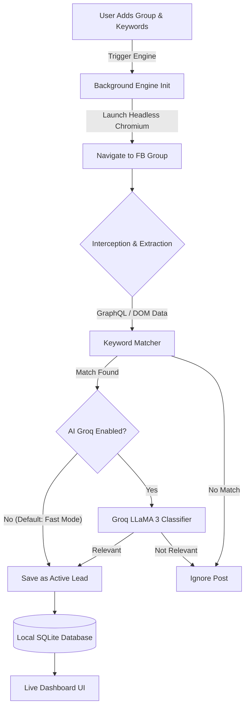
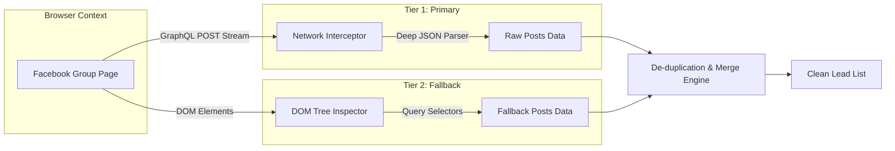
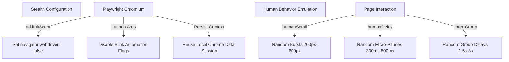
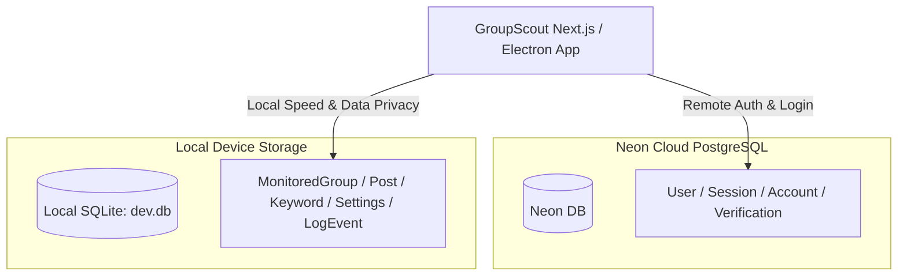
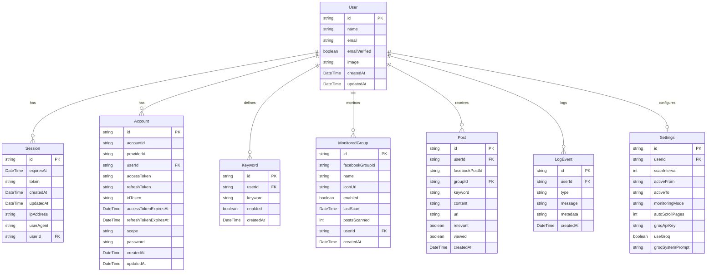

# GroupScout 🎯
> **Automated High-Intent Facebook Lead Generation & Group Monitoring**

GroupScout is an Electron & Next.js desktop software that automatically monitors Facebook Groups for high-intent lead opportunities. It runs an invisible background **Chromium** engine powered by Playwright to intercept Facebook network traffic, match your target keywords, and capture leads into a local **SQLite** database and live dashboard.

---

## 📋 Table of Contents
1. [Executive Summary](#1-executive-summary)
2. [Key Capabilities & Features](#2-key-capabilities--features)
3. [System Architecture & Workflow](#3-system-architecture--workflow)
   - [3.1 Overall End-to-End Flow](#31-overall-end-to-end-flow)
   - [3.2 Dual Extraction Scraping Pipeline](#32-dual-extraction-scraping-pipeline)
   - [3.3 Anti-Detection & Account Safety Shield](#33-anti-detection--account-safety-shield)
   - [3.4 Data Storage Architecture (SQLite + Neon)](#34-data-storage-architecture-sqlite--neon)
4. [Database Schema (ERD)](#4-database-schema-erd)
5. [Quick Start & Usage Guide](#5-quick-start--usage-guide)
6. [Tech Stack](#6-tech-stack)

---

## 1. Executive Summary

* **The Problem**: Finding clients in Facebook Groups requires hours of manual scrolling, dealing with spam, and missing urgent posts because you were away from your computer.
* **The Solution**: GroupScout acts as your 24/7 silent assistant. You add Facebook Group URLs and target keywords (e.g. *"looking for a developer"*, *"need a designer"*). GroupScout automatically browses the groups in an invisible background window, extracts newly published posts, filters out non-relevant chatter, and alerts you instantly in your dashboard with direct links to respond.

---

## 2. Key Capabilities & Features

* 👻 **Invisible Background Chromium Engine**: Operates silently in headless mode using Playwright. No annoying browser popups or stolen mouse focus.
* ⚡ **Dual Extraction Pipeline**: Combines hidden **GraphQL Network Interception** (listening to raw JSON payloads) with **DOM Parsing Fallbacks** for 100% extraction accuracy.
* 🖼️ **Instant Group Metadata Scraping**: The second you add a Facebook Group URL, GroupScout automatically fetches its real group title and cover photo upfront.
* 🚀 **Instant Lead Processing**: AI relevance filtering (`useGroq`) is turned **OFF by default**, meaning matched posts become active leads on your dashboard within seconds. (You can enable Groq LLaMA 3 AI filtering whenever needed in Settings).
* 🔒 **Local & Private Data**: All your extracted leads, keywords, and group data stay stored locally in your **SQLite** database (`dev.db`). Only user login authentication routes through **Neon PostgreSQL**.
* 🛡️ **Anti-Detection Shield**: Mimics human behavior with randomized micro-scrolling, human pauses (300ms–800ms), and automated `webdriver` evasion flags to keep your Facebook account safe.

---

## 3. System Architecture & Workflow

### 3.1 Overall End-to-End Flow



### 3.2 Dual Extraction Scraping Pipeline

GroupScout does not rely solely on fragile HTML scrapers. It uses a **two-tier extraction engine**:



1. **Tier 1 (GraphQL Interceptor)**: Listens passively to Facebook's backend `/api/graphql/` responses as the page loads. Parses deep JSON trees to extract complete post text, author info, and exact post URLs without being blocked by UI popups.
2. **Tier 2 (DOM Inspector Fallback)**: If network parsing misses a post, the engine scans visible `div[role="article"]` elements and `dir="auto"` text blocks on the webpage.

---

### 3.3 Anti-Detection & Account Safety Shield

To protect your Facebook account from bot flags, GroupScout implements multiple layers of human simulation:



---

### 3.4 Data Storage Architecture (SQLite + Neon)

GroupScout uses a **hybrid database model** for performance and privacy:



---

## 4. Database Schema (ERD)



---

## 5. Quick Start & Usage Guide

### 1. Installation
```bash
# 1. Clone the repository
git clone https://github.com/Abubakkar-Khan/Group_Scout_Electron.git
cd Group_Scout_Electron

# 2. Install dependencies
npm install

# 3. Initialize local SQLite database
npx prisma db push
npx prisma generate
```

### 2. Running Locally
```bash
# Run Next.js Web App
npm run dev

# OR Run Full Desktop Electron App
npm run electron:dev
```

### 3. Usage Steps
1. **Sign Up / Log In**: Open the app and create your account.
2. **Add Keywords**: Enter keywords like `web design`, `developer`, `plumber`, `looking for`.
3. **Add Groups**: Paste Facebook Group URLs. GroupScout will instantly fetch the group's title and cover image.
4. **Start Engine**: Click **Run Engine**. GroupScout will run invisibly in the background and surface leads live on your dashboard!

---

## 6. Tech Stack

| Layer | Technology |
| :--- | :--- |
| **Desktop Framework** | Electron + Next.js 16 (React 19) |
| **Styling & UI** | Vanilla CSS, Tailwind CSS, Shadcn UI, Lucide Icons |
| **Automation Engine** | Playwright (Headless Chromium) |
| **Local Database** | SQLite (`dev.db`) via Prisma ORM |
| **Auth Database** | Neon PostgreSQL |
| **Optional AI** | Groq SDK (LLaMA 3.1) |
