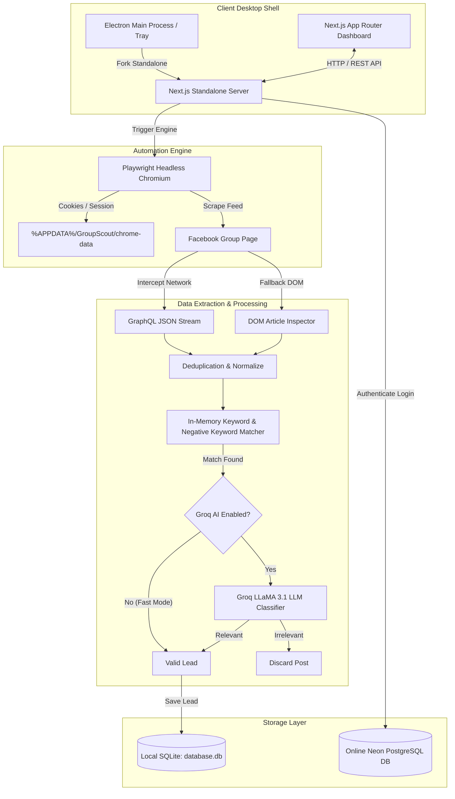
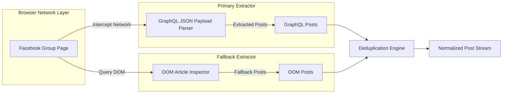
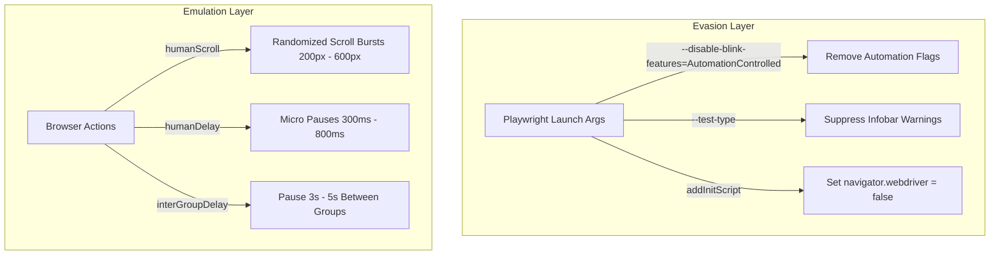
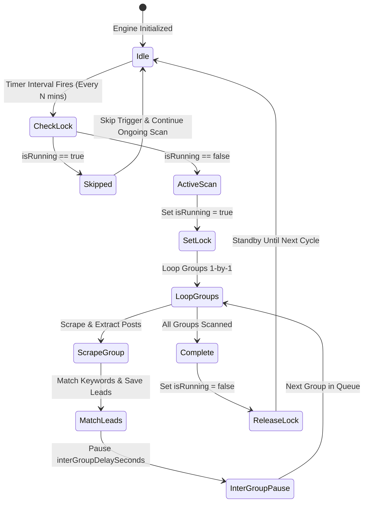
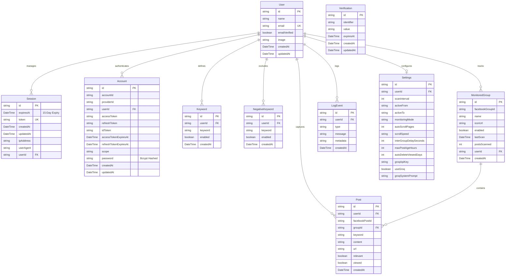

# GroupScout
> **Automated High-Intent Facebook Lead Generation & Desktop Group Monitoring System**

GroupScout is a powerful, production-grade desktop application built with **Electron**, **Next.js 16 (App Router)**, **Playwright**, **Prisma**, **SQLite**, and **Neon PostgreSQL**. It automatically monitors public and private Facebook Groups 24/7 for high-intent lead opportunities, filtering chatter and delivering leads straight to your live desktop dashboard.

---

## Table of Contents

1. [Executive Summary](#1-executive-summary)
2. [Key Architecture & Features](#2-key-architecture--features)
3. [System Architecture & Diagrams](#3-system-architecture--diagrams)
   - [3.1 End-to-End System Architecture](#31-end-to-end-system-architecture)
   - [3.2 Decoupled Dual-Database Architecture (Neon Auth + Local SQLite Data)](#32-decoupled-dual-database-architecture-neon-auth--local-sqlite-data)
   - [3.3 Dual-Tier Extraction Pipeline (GraphQL Interception + DOM Safety Net)](#33-dual-tier-extraction-pipeline-graphql-interception--dom-safety-net)
   - [3.4 Anti-Detection & Evasion Shield](#34-anti-detection--evasion-shield)
   - [3.5 Execution & Timer Lock Control Flow](#35-execution--timer-lock-control-flow)
4. [Database Entity Relationship Diagram (ERD)](#4-database-entity-relationship-diagram-erd)
5. [CSV Export & Reporting Engine](#5-csv-export--reporting-engine)
6. [Desktop Installer & Standalone Build System](#6-desktop-installer--standalone-build-system)
7. [Technology Stack](#7-technology-stack)

---

## 1. Executive Summary

* **The Problem**: Finding clients in Facebook Groups manually requires hours of endless scrolling, wading through spam, and missing urgent client requests when you are away from your PC.
* **The Solution**: GroupScout acts as a silent, intelligent 24/7 desktop assistant. You enter Facebook Group URLs and target keywords/phrases (e.g. *"looking for a web developer"*, *"need a plumber"*, *"hiring designer"*). GroupScout automatically scans target groups in an invisible background browser, extracts newly published posts, filters out non-relevant chatter, and alerts you instantly in your dashboard with direct links to respond.

---

## 2. Key Architecture & Features

* **Invisible Background Scraper Engine**: Operates silently in headless mode using Playwright Chromium. No popup windows or stolen mouse focus.
* **Dual-Tier Scraping Pipeline**: Intercepts raw Facebook **GraphQL Network Payloads** (`/api/graphql/`) for instant JSON extraction, backed by a **DOM Element Inspector** safety net for 100% post capture accuracy.
* **Decoupled Dual-Database System**:
  * **Online Neon PostgreSQL DB**: Manages authentication (`User`, `Account`, `Session`, `Verification`) with a **15-day session life**.
  * **Local SQLite DB (`database.db`)**: Stores **100% of your application data locally** (`Keyword`, `MonitoredGroup`, `Post`, `LogEvent`, `Settings`). Zero leads or keywords are ever pushed online.
* **Smart Local User Pre-Sync (`ensureLocalUser`)**: Automatically validates and syncs user profiles into local SQLite before performing relational operations (adding groups, keywords, or leads), preventing foreign key constraints or stale record conflicts.
* **Next.js 16 Standalone Packaging**: Built with `output: "standalone"`, bundling server dependencies into a self-contained runtime that executes seamlessly on clean client machines without requiring Node.js.
* **Smart Sequential Queue & Timer Lock**: Scans groups 1-by-1 with human-like delays. If a scan is running when the interval timer fires, the trigger is safely skipped so ongoing scans are never interrupted or restarted mid-way.
* **UTF-8 BOM CSV Exporter**: Generates clean CSV reports (up to 5,000 records) filtered by date/time ranges (`24h`, `7d`, `30d`, `All Time`), keywords, or status with proper character encoding for Microsoft Excel.
* **Sleek Custom Desktop UI**: Custom dark-mode scrollbars, frameless window setup, auto-hide menu bar, and system tray minimize support.
* **External Link Handler**: All lead links automatically open in your default system browser (Chrome, Edge, Brave) using Electron's `shell.openExternal`.

---

## 3. System Architecture & Diagrams

### 3.1 End-to-End System Architecture

---

### 3.2 Decoupled Dual-Database Architecture (Neon Auth + Local SQLite Data)

GroupScout enforces strict separation between authentication and user data to ensure maximum privacy and offline performance:

```mermaid
graph TD
    App[GroupScout Application Engine]

    subgraph Online Cloud Storage
        Neon[(Neon PostgreSQL DB)]
        AuthData[User / Account / Session / Verification]
        SessionPolicy[15-Day Session Expiration Policy]
    end

    subgraph Local PC Disk Storage
        SQLite[(Local SQLite: database.db)]
        AppData[MonitoredGroup / Post / Keyword / NegativeKeyword / LogEvent / Settings]
    end

    App -->|1. Online Auth Check| AuthData
    AuthData --> SessionPolicy
    App -->|2. Auto-Sync User Record| SQLite
    App -->|3. 100% Local App Data| AppData

    style Online Cloud Storage fill:#1e293b,stroke:#3b82f6,stroke-width:2px;
    style Local PC Disk Storage fill:#064e3b,stroke:#10b981,stroke-width:2px;
```

* **Automatic User Sync & FK Protection (`ensureLocalUser`)**: When you log in or create app data, `ensureLocalUser()` authenticates your session online via Neon DB, then automatically caches/upserts your `User` record into local SQLite (`database.db`). If a stale local record with the same email exists under an old ID, it automatically cleans it up to guarantee foreign key integrity for `MonitoredGroup`, `Keyword`, and `Post`.

---

### 3.3 Dual-Tier Extraction Pipeline (GraphQL Interception + DOM Safety Net)

1. **Tier 1 (GraphQL Interceptor)**: Listens passively to Facebook's backend `/api/graphql/` responses as the page loads. Parses deep JSON payload structures to extract full post text, author info, and exact post permalinks.
2. **Tier 2 (DOM Inspector Fallback)**: Scans visible `div[role="article"]` elements and `dir="auto"` text blocks on the webpage to capture any post that network interception missed.

---

### 3.4 Anti-Detection & Evasion Shield

---

### 3.5 Execution & Timer Lock Control Flow

---

## 4. Database Entity Relationship Diagram (ERD)

---

## 5. CSV Export & Reporting Engine

GroupScout features a full-fidelity CSV reporting module on the **Leads Dashboard**:

* **Multi-Filter Fetching**: Exports up to **5,000 matching leads** across all pages based on your active filters (**Time Range: 24h, 7d, 30d, or All Time**, Keywords, Monitored Groups, Search Query, Status).
* **UTF-8 Byte Order Mark (`\uFEFF`)**: Embedded UTF-8 BOM encoding ensures Microsoft Excel and Google Sheets open exported CSV files cleanly without character corruption.
* **Blob Object Download (`URL.createObjectURL`)**: Prevents string truncation, corrupted URI encoding (`encodeURI`), or broken special characters (`#`, `%`, `&`, emojis, line breaks).

---

## 6. Desktop Installer & Standalone Build System

GroupScout is packaged using **`electron-builder`** and Next.js **Standalone Output Mode**:

* **Zero External Dependencies**: The installer packages Electron's embedded Node.js runtime (`ELECTRON_RUN_AS_NODE: "1"`) alongside `.next/standalone`, allowing the application to install and execute seamlessly on clean Windows and macOS computers without Node.js installed.
* **Writable AppData Pathing**: In production, SQLite files and session cookies are located in `%APPDATA%\GroupScout` (`~/Library/Preferences/GroupScout` on macOS), ensuring full read/write access outside read-only ASAR archives.

---

## 7. Technology Stack

| Layer | Technology |
| :--- | :--- |
| **Desktop Framework** | Electron + Next.js 16 (React 19, Standalone Mode) |
| **Styling & Theme** | Vanilla CSS, Tailwind CSS, Shadcn UI, Lucide Icons, Custom WebKit Scrollbars |
| **Automation Engine** | Playwright (Headless Chromium) |
| **Auth Database** | Neon PostgreSQL (15-Day Session Duration) |
| **Local Application Database** | SQLite (`database.db`) via Prisma ORM |
| **Optional AI Filter** | Groq SDK (LLaMA 3.1) |
| **Packaging & Distribution** | `electron-builder` (NSIS Installer for Windows / DMG for macOS) |
